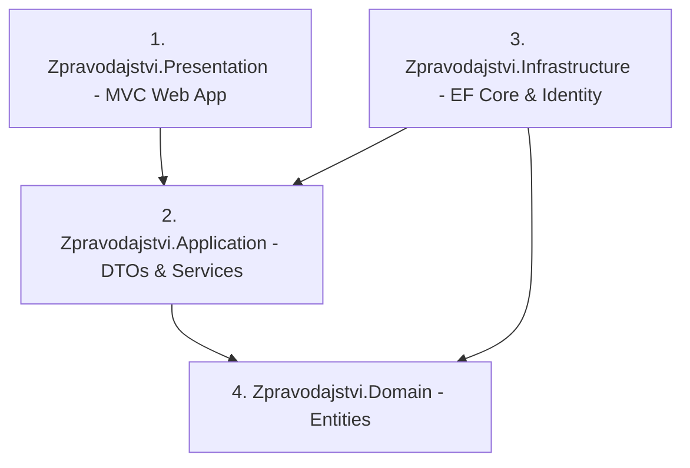

# 📰 ZPRAVODAJSTVÍ - DOKUMENTACE PROJEKTU (.NET 10)

Vítejte v dokumentaci webové aplikace **Zpravodajství**, vyvíjené v prostředí **ASP.NET Core (.NET 10)** s využitím **vrstvené architektury (Clean Architecture / Onion Architecture)**, **Entity Framework Core (SQLite)** a **ASP.NET Core Identity**.

---

## 👥 Autoři projektu
* **Osoba A (Administrace, Články, Databáze & Soubory):** Mykhailo Melnyk
* **Osoba B (Uživatelé, Komentáře, Validace, Architektura & Testy):** Tomáš Svobodník

---

## 🚀 Hlavní vlastnosti a funkcionality

### 🌐 Veřejné rozhraní & Čtenářský portál
* **Výpis článků a vyhledávání:** Prezentace zpráv s vyhledáváním v titulcích i obsahu.
* **Kategorie & Štítky (#tags):** Dynamická filtrace článků podle rubrik a hashtagů.
* **Detail článku & Galerie:** Zobrazení plného textu, perexu, publikovaného data a nahraných obrázků.
* **Diskuze a komentáře:**
  * Možnost přidávat komentáře pro přihlášené uživatele s rolí **Čtenář**.
  * **Svázané jméno:** Uživatelské jméno je uzamčeno (`readonly`) a odpovídá přihlášenému účtu.
  * **Profanity filtr (`[NoProfanity]`):** Vlastní serverová i klientská validace blokující vulgarismy v komentářích i jménech.

### ⚙️ Administrační sekce (`/Admin`)
* **Správa uživatelských účtů (Admin pouze):**
  * Přehledná tabulka všech zaregistrovaných uživatelů.
  * Úprava e-mailu, celého jména a přiřazené role (`Admin`, `Redaktor`, `Čtenář`).
  * Možnost resetu / změny hesla u kteréhokoliv účtu.
  * Bezpečné mazání uživatelských účtů.
* **Správa článků (Admin & Redaktor):**
  * Vytváření, úprava (Editace) a mazání článků.
  * Nahrávání obrázků (Upload souborů do `wwwroot/uploads`).
* **Správa kategorií (Admin & Redaktor):**
  * Vytváření nových rubrik a mazání stávajících kategorií.

### 🎨 Vzhled & Témata (Light / Black Mode)
* **Přepínač motivů (`☀️ Light` / `🌙 Black`):** Tlačítko v navigaci umožňuje přepínat mezi světlým a tmavým režimem.
* **Persistování nastavení:** Vybrané téma se ukládá do `localStorage` a načítá bez problikávání.
* **Vysoký kontrast v Dark Mode:** Všechny nadpisy, karty článků, diskuze i formuláře se automaticky přizpůsobují dark mode pro perfektní čitelnost.

---

## 🛠️ Použité technologie & Knihovny

* **Cílový framework:** .NET 10 (`net10.0`, SDK `10.0.401` přes `global.json`)
* **ORM:** Entity Framework Core `10.0.12` (SQLite)
* **Webový framework:** ASP.NET Core Web App (MVC)
* **Identita a přístup:** ASP.NET Core Identity (Role: `Admin`, `Redaktor`, `Ctenar`)
* **Logování:** Serilog (`Serilog.AspNetCore`, výstup do konzole a `logs/log.txt`)
* **Testování:** xUnit + Moq (19 unit testů v `Zpravodajstvi.Tests`)
* **Styling:** Bootstrap 5 + Vlastní CSS (`site.css`) s podporou `data-bs-theme`

---

## 🏗️ Architektura a struktura vrstev

Projekt je rozdělen do **4 oddělených vrstev**:



1. **`Zpravodajstvi.Domain` (`src/Zpravodajstvi.Domain`)**
   * Čisté C# entity bez vnějších závislostí: `Category`, `Article`, `Comment`, `Tag`, `Image`.
2. **`Zpravodajstvi.Application` (`src/Zpravodajstvi.Application`)**
   * Rozhraní (`IArticleService`, `ICommentService`, `ICategoryService`), DTOs (`ArticleListDto`, `ArticleDetailDto`, `CreateCommentDto`), custom validační atributy (`NoProfanityAttribute`).
3. **`Zpravodajstvi.Infrastructure` (`src/Zpravodajstvi.Infrastructure`)**
   * Přístup k databázi SQLite, `ApplicationDbContext`, `ApplicationUser`, repozitáře a seedování dat (`DbInitializer`).
4. **`Zpravodajstvi.Presentation` (`src/Zpravodajstvi.Presentation`)**
   * MVC Kontrolery (`HomeController`, `CommentsController`, `AccountController`), Admin Area (`ArticleController`, `CategoryController`, `UserController`), pohledy (Views) a klientské skripty (`site.js`).

---

## 📋 Přehled odevzdaných požadavků

### Fáze 1: Základ a architektura
* [x] **Založení 4 vrstev (Domain, Application, Infrastructure, Presentation)**
* [x] **Návrh doménových entit a DbContextu pro SQLite**
* [x] **Code-First inicializace a seedování dat (DbInitializer)**
* [x] **Návrh rozhraní (Interfaces) a DI registrace v Program.cs**

### Fáze 2: Správa obsahu, Uživatelé, Validace, Testy & UI
* [x] **Area "Admin":** Oddělená administrace pro správu článků, kategorií a účtů.
* [x] **CRUD Článků & Kategorií:** Načítání, tvorba, úprava, mazání a filtrace.
* [x] **Upload souborů:** Nahrávání obrázků k článkům do `wwwroot/uploads`.
* [x] **Identity Framework:** Úlohy a role (`Admin`, `Redaktor`, `Ctenar`).
* [x] **Správa uživatelských účtů (Admin):** Změna e-mailů, jmen, rolí, hesla a mazání účtů.
* [x] **Validace a NoProfanity filtr:** Serverová i klientská kontrola vulgarismů.
* [x] **Svázané jméno u komentářů:** Atribut `readonly` znemožňující přepsání jména přihlášeného uživatele.
* [x] **Přepínač motivů (Light / Black):** Tmavý režim s ukládáním do `localStorage` a správným kontrastem textu a pozadí diskuze.
* [x] **Logování:** Integrován Serilog s výstupem do souboru `logs/log.txt`.
* [x] **Unit Testy:** 19 xUnit + Moq unit testů pokrývajících logiku služeb, kontrolerů a validací.

---

## 💻 Jak projekt sestavit a spustit

### 1. Sestavení řešení
```bash
dotnet build Zpravodajstvi.sln
```

### 2. Spuštění unit testů
```bash
dotnet test Zpravodajstvi.sln
```

### 3. Spuštění webové aplikace
```bash
dotnet run --project src/Zpravodajstvi.Presentation/Zpravodajstvi.Presentation.csproj
```

Aplikace bude dostupná v prohlížeči na adrese: `https://localhost:5001` nebo `http://localhost:5000`.

---

## 🔑 Předpřipravené testovací účty

Po prvním spuštění databáze automaticky vytvoří tyto účty (heslo pro všechny: `Heslo123!`):

| Role | E-mail | Heslo | Oprávnění |
| :--- | :--- | :--- | :--- |
| **Admin** | `admin@zpravodajstvi.cz` | `Heslo123!` | Plná správa (Články, Kategorie, Správa účtů, Hesla, E-maily) |
| **Redaktor** | `redaktor@zpravodajstvi.cz` | `Heslo123!` | Správa článků a kategorií |
| **Čtenář** | `ctenar@zpravodajstvi.cz` | `Heslo123!` | Čtení zpráv a přidávání komentářů |

---
